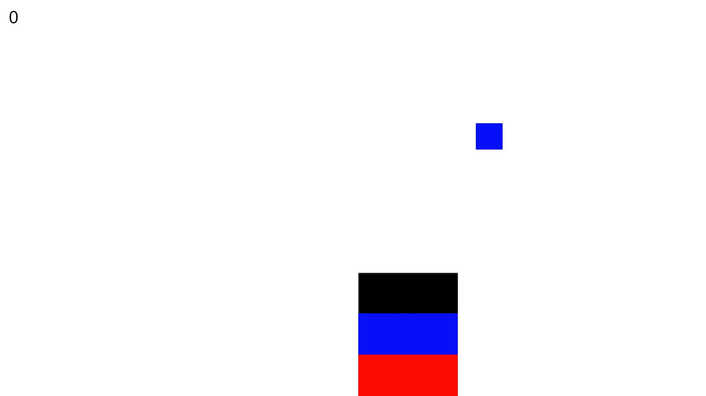

# workshop-construct2
Repositório de apoio ao workshop de C2 na Faculdade Bilac.

## Jogo
O jogo que vamos construir é o básico, porém divertido, _Catch Blocks_. O jogador é encarregado de pegar todas as cores que estão no céu, no entanto, para que isso sejá possível, é necessário que ele esteja com a mesma cor que a peça.

## Controles
Mouse - Movimentação
Barra de Espaços - Altera a cor do jogador

## Didática
Neste jogo usamos a grande parte dos recursos fundamentais do C2:
- Objetos (_Sprite_, _Tiled Background_, _Keyboard_, _Mouse_)
- Músicas e sons
- Folha de Eventos (eventos de colisão, variáveis, objeto _System_, condicionais, funções nativas)
- Comportamentos (_Custom Moviment_)
- Etc 